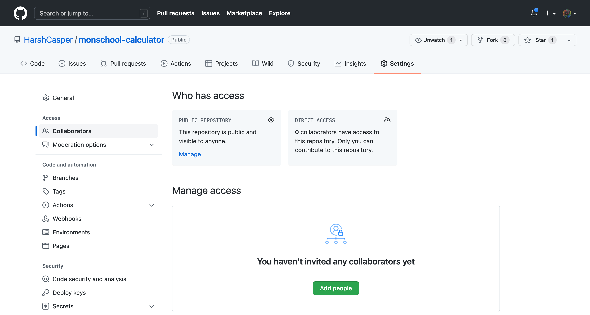
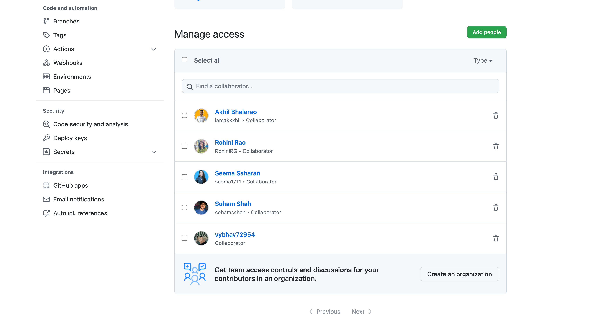

On GitHub, you can add external collaborators to work on your private and public repositories. A collaborator is a person who has access to your repository, and can push changes to the project without any external review. It is useful to have collaborators if you are working in a team and want to everyone within your team to have an equal ownership of the project.

A collaborator on your project:

- Create, merge, close pull requests on your repository.
- Create and close issues on your repository.
- Create, edit or delete commits from the repository.
- Manage releases, actions, packages and other resources on your repository.

## Adding new collaborators

To add a new collaborator, click on the **Settings** tab of your repository and then click on the **Collaborators** tab. You will be prompted for the password of your personal GitHub account to ensure that you are the owner of the repository. You will see a page like this:



You can now click on `Add people` to invite external collaborators to your repository. You can add collaborators by email address, or by username. After you select an external collaborator, you will be prompted by GitHub to invite them to your repository. Once you click the button, inviting them, they will receive a mail with a link to join your repository.

The invite expires 7 days if not accepted. If the user accepts, they can now access all the settings, resources and integrations available on your repository. This is how the collaborator page for an open-source project looks like:



In a GitHub organization, you can have more fine-grained control over different collaborators. A GitHub organization can have multiple repositories, and each repository can have multiple collaborators, distributed across the entire company. It is recommended to setup an organization for your project, if you have multiple repositories.

On a GitHub organization, you can specify the collaborator access for each repository. You can have various roles like `Read`, `Write`, `Maintain` and `Admin` depending on their roles and responsibilities for each repository.

## How do collaborators work?

Collaborators can work on the same default branch as you. They can also push their work over using `git push` as you. Without the collaborator access, they will not be able to push their work. Let us say, your project mate if trying to push to your `monschool-calculator` project. If they happen to clone your project and make a commit, they will see the following output while pushing:

```sh
ERROR: Permission to harshcasper/monschool-website.git denied to XXX.
fatal: Could not read from remote repository.

Please make sure you have the correct access rights
and the repository exists.
```

A collaborator can push their work to your repository since they have the `Write` access. It also means that you would require yourself to pull their work every now and then to make sure that you are always up to date and on the same page.

It also arises a new problem! What if the change you are pushing to a file has already been changed? It can happen because of various reasons. Maybe you didn't take a pull and now you are pushing to a file that has been changed by someone else. This would lead to a conflict (often called as a merge conflict) which would need to be fixed by you or the collaborator.

This brings up the necessity of addressing a few issues while working with a collaborator:

- How can we pull someone else's changes from a project that we are working on?
- How can we resolve a conflict that may occur because of changes being done to same set of files?
- How can we work on a project parallely without overwriting each other's changes?
- How we can set a continuous review process to ensure continuity of work?

This is where we can capitalize on Git & GitHub's individual features to drive our work and collaboration. We will uncover all of this in the next sections of this chapter!
