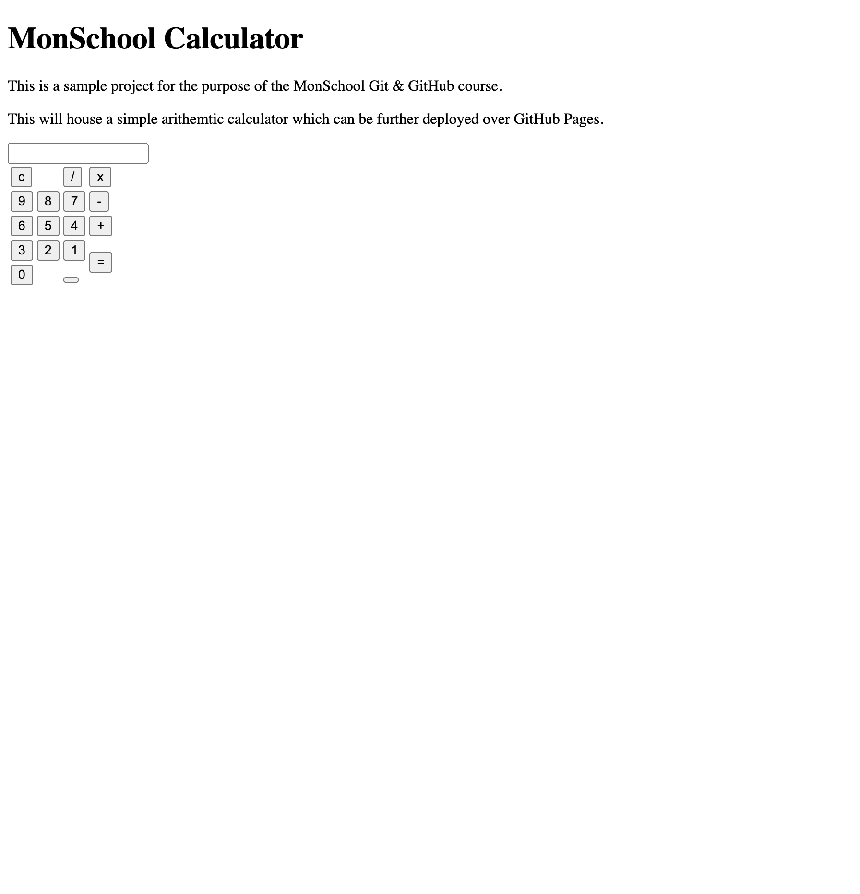

Under specific scenarios, you might want to work on specific features parallely. Let us take an example — You are working on your project and you discovered a bug that affects a major functionality. You need to fix it as soon as possible, but you also want to make sure that this fix is reviewed by others before you commit it, and it should not interfere with other developers at the same time.

This is where Git branching comes into play. Git branching allows you to diverge from the main version of your code to fix a bug or add a new features. You can create a branch with a copy of your code. When you are done, you can merge the branch back into the main version of your code. This allows you to work on different versions of your code at the same time parallely.

## What are branches?

A Git branch is a version of your code that has diverged from the main working version of your code. This main working version of your code will be present in the `main` branch. There is nothing significant about the `main` branch — It is just the first branch that GitHub initializes for us and where all our primary work should be present.

If you are working on a production-level project, your team might possess a `develop` branch to make sure all your development work is committed to the `develop` branch. This is where you will work on your project and make sure that all your changes are reviewed by your team before you commit them.

Internally, Git branching is an interesting concept. When you create a commit, Git creates a snapshot of files with a hash. When you create a branch, Git creates a pointer to the commit where the `main` branch is currently on. As you commit on your branch, Git creates new pointers and knows where your branch is by using a special pointer called `HEAD`.

Through Git branching, you can create multiple parallel development workflows for your project. You can work on entirely different tasks at the same time, merge these branches with the `main` branch once you are satisfied, and delete the old branch when the work is complete.

## Create a new branch

Let us add some new features to our `monschool-calculator` project. We need to add the HTML for our calculator. Right now, we are working locally and we do not want to disturb the `main` branch. So, we will create a new branch called `monschool-calculator-html`.

Before that, let's check which branches we are currently on in our repository. To do that, we can use the `git branch` command:

```sh
$ git branch

* main
(END)
```

Press `q` to exit. As you can see, we are on the `main` branch of the repository. We don't have any other branches over here. Its simply because we have not yet created any branch. Let's create a new branch called `monschool-calculator-html`. To do that we can use the `git branch` command again:

```sh
git branch monschool-calculator-html
```

If you do a `git branch` now, we will see the following:

```sh
* main
  monschool-calculator-html
```

The `*` pointer shows where we currently are. Though we have created a new branch, we are still on the `main` branch. Let's navigate to the new branch. To do that, we use the `git checkout` command:

```sh
git checkout monschool-calculator-html
```

If you do a `git branch` now, we will see the following:

```sh
  main
* monschool-calculator-html
```

We have moved our entire workspace from the `main` branch to the `monschool-calculator-html` branch. We can now make some changes inside our `index.html` file. Let's add the following HTML:

```html
<div class="container">
   <div class="calc">
      <input type="text" name="input" id="input">
      <div class="keys">
         <table>
            <tr>
               <td colspan="2"><button onclick="c()" class="row">c</button></td>
               <td><button onclick="fun('/')">/</button></td>
               <td><button onclick="fun('*')">x</button></td>
            </tr>
            <tr>
               <td><button onclick="fun(9)">9</button></td>
               <td><button onclick="fun(8)">8</button></td>
               <td><button onclick="fun(7)">7</button></td>
               <td><button onclick="fun('-')">-</button></td>
            </tr>
            <tr>
               <td><button onclick="fun(6)">6</button></td>
               <td><button onclick="fun(5)">5</button></td>
               <td><button onclick="fun(4)">4</button></td>
               <td><button onclick="fun('+')">+</button></td>
            </tr>
            <tr>
               <td><button onclick="fun(3)">3</button></th>
               <td><button onclick="fun(2)">2</button></th>
               <td><button onclick="fun(1)">1</button></td>
               <td rowspan="2"><button  onclick="func()" class="col">=</button></td>
            </tr>
            <tr>
               <td colspan="2"><button onclick="fun(0)" class="row">0</button></td>
               <td>
                  <button onclick="fun('.')">
                     <div class="point"></div>
                  </button>
               </td>
            </tr>
         </table>
      </div>
   </div>
</div>
```

The above HTML would go inside the `<body>` tag. We have created a `<div>` named `container` and create a table with all the elements that we can expect to use in a basic calculator. For the purpose of functionality, we have used the `fun()`, `func()` and `c()` functions using an `onclick` attribute. We will define them later. On launching the `index.html` on a browser you will see the following:



Let's check our `git status` to see if we have any changes:

```sh
$ git status

On branch monschool-calculator-html
Changes not staged for commit:
  (use "git add <file>..." to update what will be committed)
  (use "git restore <file>..." to discard changes in working directory)
	modified:   index.html

no changes added to commit (use "git add" and/or "git commit -a")
```

Go ahead and make a commit. After making a commit, check the commits using the `git log` command:

```sh
$ git log

commit 664c2eb1ed65a190644835aff2d79277f36a00c7 (HEAD -> monschool-calculator-html)
Author: HarshCasper <erbeusgriffincasper@gmail.com>
Date:   Mon Mar 21 11:42:46 2022 +0530

    add HTML for the calculator page
```

We have made a new commit on our branch!

## Naming your branches

Branch names can be anything you prefer! However, just like commit messages, it should be meaningful and crisp for others to understand what you are doing. You can name the branch in the following ways:

- `@username/description-of-task`
- `@username/ticket-number-of-task`
- `feature/feature-name`
- `bugfix/bug-fix-name`
- `chore/chore-name`

Having a unique yet crisp branch name can make you easily switch between multiple branches and carry your work forward.

## Creating a branch from another branch

Most development teams have a `develop` branch. This is where all the work is done. We can create a new branch from the `develop` branch by using the same commands as before. Let's say that we want to create a new branch called `monschool-calculator-html-2`. We can do that by using the `git branch` and `git checkout` commands. However, Git also provides us a shortcut to skip writing two commands. You can use the `git checkout -b` command to create a new branch from the existing branch. Let's try that out:

```sh
git checkout -b monschool-calculator-html-2
```

If you do a `git log` now, you will see the following:

```sh
commit 664c2eb1ed65a190644835aff2d79277f36a00c7 (HEAD -> monschool-calculator-html-2, monschool-calculator-html)
Author: HarshCasper <erbeusgriffincasper@gmail.com>
Date:   Mon Mar 21 11:42:46 2022 +0530

    add HTML for the calculator page
```

You can see that we have the commits from the `monschool-calculator-html` branch in the `monschool-calculator-html-2` branch. This shows that we have created a new branch from the `monschool-calculator-html` branch.

## Deleting a branch

You can easily delete a branch by using the `git branch -d` command. For example, let's delete the `monschool-calculator-html-2` branch:

```sh
$ git branch -d monschool-calculator-html-2

Deleted branch monschool-calculator-html-2 (was 664c2eb).
```

As a word of caution, you cannot delete the branch that you are on right now. Check that using the `git branch` command, and checkout to another branch if you need to delete it.
