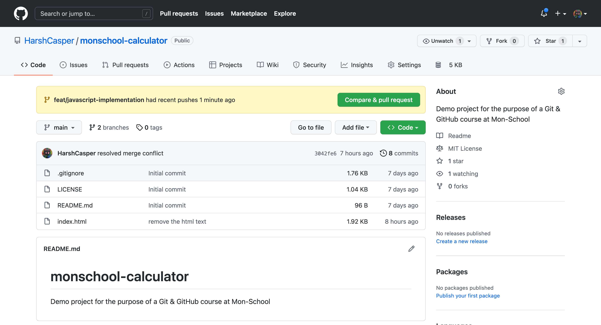
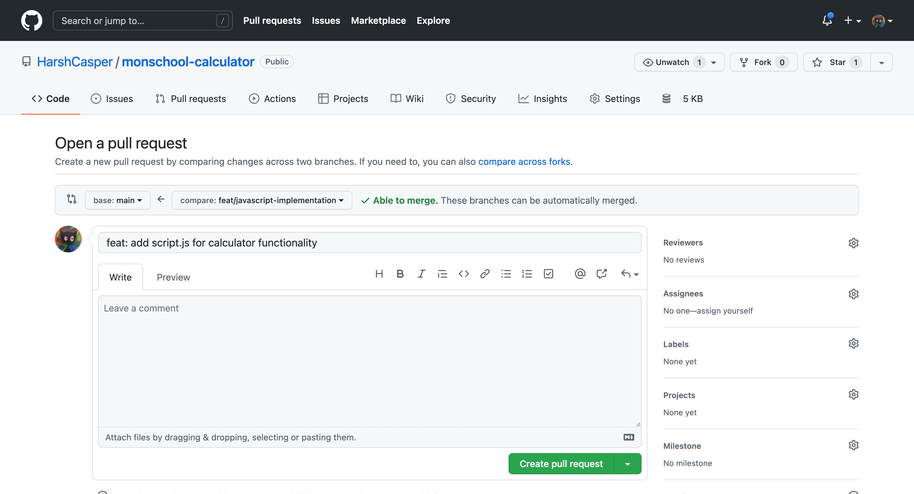
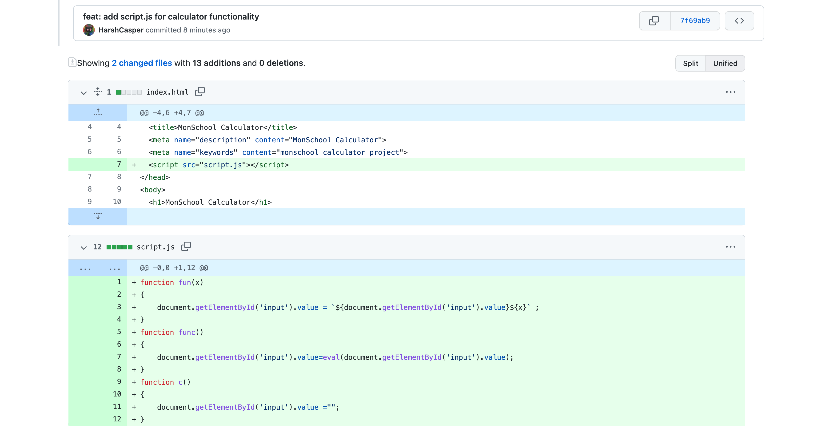
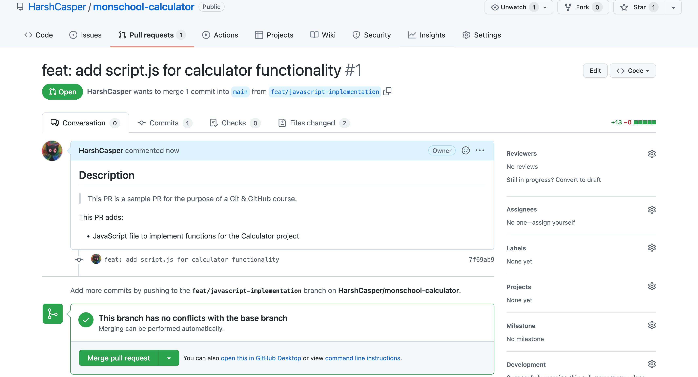
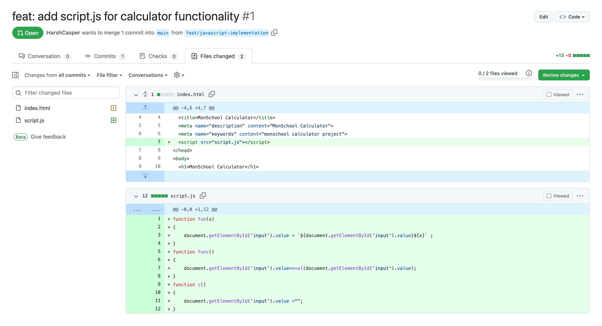
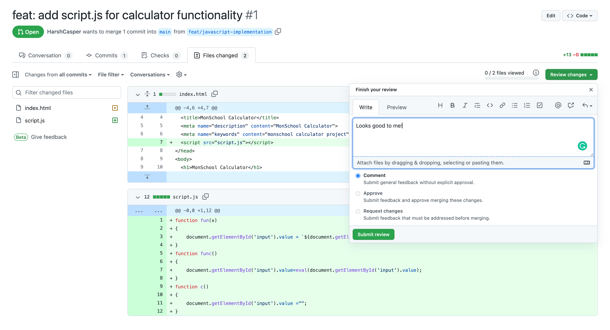

In the previous sections, we have explored how we can make a branch in our repository, and how we can merge our branch into the `main` branch. But in many situations, you would ideally like to have your commits reviewed by a human before they are merged into the `main` branch. It will ensure the sanity of the code, and will also ensure that the code is correct. You might also want to run some automated tests on your code before merging.

In this situation, it is beneficial for us to push our commits to a remote repository and propose changes using a pull request. A pull request is a way to tell others about the changes you have pushed to a remote repository and that you would like to incorporate them into the `main` branch. The pull request is gence reviewed, possible modifications are discussed, and after follow-up commits it is merged into the `main` branch.

## Why use Pull Requests?

Pull Requests stem from the concept of shared repository model, where collaborators are able to push changes to a single shared repository. This is a common practice in software development, and is also common in the industry. If you are a part of a team, and plan to make contributions, you will have to create a branch and propose your changes to the `main` branch, through a pull request.

A pull request facilitates easy code reviews, automated tests, and code sanity checks and provides a direction to the overall flow of the project. It is also easier to catch conflicts early on and resolve them before merging.

## Making a Pull Request

Let's create a pull request now! To do that, go ahead and make a branch using the `git checkout -b` command. We will make a pull request to add a JavaScript file with the three functions we had defined earlier in the `index.html` file.

Create a branch named `feat/javascript-implementation`:

```sh
git checkout -b feat/javascript-implementation
```

Let us go ahead and make a JavaScript file named `script.js` and add the three functions we have defined earlier in the `index.html` file:

```js
function fun(x)
{
    document.getElementById('input').value = `${document.getElementById('input').value}${x}` ;
}
function func()
{
    document.getElementById('input').value=eval(document.getElementById('input').value);
}
function c()
{
    document.getElementById('input').value ="";
}
```

You can now see that your calculator is working as expected. Go back to the `index.html` and reference `script.js` in the `<script>` tag over the `index.html` file. Go ahead and make a commit:

```sh
$ git add .
$ git commit -m "feat: add script.js for calculator functionality"

[feat/javascript-implementation 7f69ab9] feat: add script.js for calculator functionality
 2 files changed, 13 insertions(+)
 create mode 100644 script.js
```

You can now push your changes to the remote repository. Since we have created a branch named `feat/javascript-implementation`, we will push our changes to the remote repository using the `git push` command by referencing the `<remote_name>` and the `<branch_name>`. The `remote_name` is the URL which has been pre-configured by Git. The `branch_name` is the name of the branch we have created.

```sh
$ git push origin feat/javascript-implementation

Enumerating objects: 6, done.
Counting objects: 100% (6/6), done.
Delta compression using up to 10 threads
Compressing objects: 100% (4/4), done.
Writing objects: 100% (4/4), 495 bytes | 495.00 KiB/s, done.
Total 4 (delta 2), reused 0 (delta 0), pack-reused 0
remote: Resolving deltas: 100% (2/2), completed with 2 local objects.
remote: 
remote: Create a pull request for 'feat/javascript-implementation' on GitHub by visiting:
remote:      https://github.com/HarshCasper/monschool-calculator/pull/new/feat/javascript-implementation
remote: 
To github.com:HarshCasper/monschool-calculator.git
 * [new branch]      feat/javascript-implementation -> feat/javascript-implementation
```

As you can see on the terminal output above, you are now being prompted to create a pull request. You can now make a pull request to add the JavaScript file to the repository.

Go over your repository and you will see something like this:



Go ahead and click the big green button titled `Compare & pull request`. You will see the following presented to you:



You will be prompted to fill in the necessary details for your pull request. On a high-level these information are:

- Title: The title of your pull request. On the above example, its the same as the commit message.
- Body: The description of your pull request. You can add as much description as you want and check the preview.
- Reviewers: The people who will review your pull request. You can manually assign reviewers. You cannot review your own pull request.
- Assignees: The people who will be assigned to your pull request. You can manually assign it to yourself.
- Project & Milestone: The project and milestone you want to assign to your pull request.

You can also check the changes that have been made to the repository. Scroll down to the bottom of the page and you will see the changes that have been made to the repository:



Go ahead and click the `Create Pull Request` button. You will see the following now:



In our case, the pull request URl is `https://github.com/HarshCasper/monschool-calculator/pull/1`. You can share the URL in your case with your team members for the review.

## Reviewing a Pull Request

You can review a pull request by visiting the pull request URL. To review a pull request, navigate to the `Files changed` section and you will see the changes that have been made to the repository.



You can put up a review by clicking on the `Review changes` button, and adding a comment to the pull request.



In this case, you can see that I can put up a `Comment` but not an `Approve` or `Request changes`. Its because a pull request author cannot approve or request changes off their own pull request. If you are reviewing someone else's pull request, you can either approve it or request changes.

To put an inline review, click on the `+` symbol in front of each line of the changed code to add a comment.


This is how you can collaborate and provide your reviews on a pull request!
