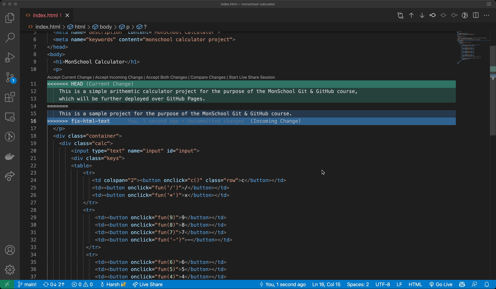

As we checked out in the previous section, `git merge` allows us to merge two branches together. It is a good practise to have all of our development work distributed across various branches, so that we can easily switch between them. It also means that we should regularly be able to merge our work back into the master branch, so that we can easily share our work with others.

In the example in the previous section, you might have seen a phrase `Fast-forward` merge. This means that the changes from the branch we are merging into the master branch are moved into the master branch. Git knows and understands what it is doing and merges those changes. 

But what about a merge which generates some conflict? Its termed as a `Non-Fast-Forward` merge. Git does not know what it is doing and does not merge those changes. It further creates scary merge conflicts which needs to be resolved manually. Let's check out how we can resolve those merge conflicts.

## Why merge conflicts?

One of the questions that might arise is why do we need to resolve merge conflicts? Why do Git conflicts exist?

Its simply because we are integrating commits from multiple branches into a single branch. While integrating these changes, we can run into a conflict where two different commits concern the same file. As soon as automatic integration fails, a merge confluct occurs. It becomes necessary then to resolve contradictory changes, so that Git can make sure which change you would prefer.

In real-world scenario, you might come across a merge conflict multiple times. This especially happens when you are working on a large project and multiple people push changes their branch and try to merge their changes. In this situation, being equipped with the knowledge of resolving merge conflicts is a good idea.
## Resolving Merge Conflicts

To better understand this, let's try an example. Go to your `monschool-website` repository and create a new branch called `fix-html-text`. Go ahead and make a change on the `index.html` file on the line `This will house a simple arithemtic calculator which can be further deployed over GitHub Pages.`.

You can delete this line from the file. Make a commit on the `fix-html-text` branch. If you want to visualize your changes, you can use the `git show` command:

```sh
$ git show

commit 648234885eb207cc235221a9cfb48bc4c4179d2b (HEAD -> fix-html-text)
Author: HarshCasper <erbeusgriffincasper@gmail.com>
Date:   Mon Mar 21 15:56:55 2022 +0530

    remove the html text

diff --git a/index.html b/index.html
index e144424..9629217 100644
--- a/index.html
+++ b/index.html
@@ -10,9 +10,6 @@
   <p>
     This is a sample project for the purpose of the MonSchool Git & GitHub course.
   </p>
-  <p>
-     This will house a simple arithemtic calculator which can be further deployed over GitHub Pages.
-  </p>
   <div class="container">
     <div class="calc">
         <input type="text" name="input" id="input">
```

Let's switch back to the `main` branch. On the `main` branch, instead of merging the `fix-html-text` branch, we will make another change on the same file and line. In this case, delete the line `This will house a simple arithemtic calculator which can be further deployed over GitHub Pages.` and make changes to the previous line to reflext this information. Commit your changes on the `main` branch and use `git show` to visualize your changes:

```sh
commit 29aa2a023afaa3f6e44883cc2ceef21c30f5c7d0 (HEAD -> main)
Author: HarshCasper <erbeusgriffincasper@gmail.com>
Date:   Mon Mar 21 16:00:55 2022 +0530

    remove the html text

diff --git a/index.html b/index.html
index e144424..e7d10d3 100644
--- a/index.html
+++ b/index.html
@@ -8,10 +8,8 @@
 <body>
   <h1>MonSchool Calculator</h1>
   <p>
-    This is a sample project for the purpose of the MonSchool Git & GitHub course.
-  </p>
-  <p>
-     This will house a simple arithemtic calculator which can be further deployed over GitHub Pages.
+    This is a simple arithemtic calculator project for the purpose of the MonSchool Git & GitHub course, 
+    which will be further deployed over GitHub Pages.
:
```

Now, it's time to merge! Let's merge the `fix-html-text` branch into the `main` branch:

```sh
$ git merge

Auto-merging index.html
CONFLICT (content): Merge conflict in index.html
Automatic merge failed; fix conflicts and then commit the result.
```

Our merge operation has failed! However, Git has modified the file with the merge to show where exactly the conflict is. Let's see what the file looks like:



The `<<<<< HEAD` pointer is pointing our branch (the `main` branch) while the `>>>>>>> fix-html-text` pointer is pointing the `fix-html-text` branch. This means that the changes from the `fix-html-text` branch are being moved into the `main` branch and a conflict has been caused.

You can now, simply edit the file and remove the extra stuff that Git has added. It can be done by choosing the correct line of code and then deleting everything. On a code editor like VS Code, you can accept the current change, or the incoming change, or both.

In my case, I choose to accept the current change. You can click on the `Accept Current Change` button. You can manually delete rest of the lines and stuff Git has added. It would look like this later:


You can now go ahead and commit your changes:

```sh
$ git add .
$ git commit -m "resolved merge conflict"
$ git log

commit 3042fe6301bc0ad2be275e2ebfc733143bb4b750 (HEAD -> main)
Merge: 29aa2a0 6482348
Author: HarshCasper <erbeusgriffincasper@gmail.com>
Date:   Mon Mar 21 16:22:49 2022 +0530

    resolved merge conflict

commit 29aa2a023afaa3f6e44883cc2ceef21c30f5c7d0
Author: HarshCasper <erbeusgriffincasper@gmail.com>
Date:   Mon Mar 21 16:00:55 2022 +0530

    remove the html text
```

You can see that our commit has been successful. You can now go ahead and delete the `fix-html-text` branch.

In some situations, you might just want to undo a merge conflict and return to the previous state. In this case, it is great to use a flag called `--abort`. This flag allows you to undo a merge conflict and return to the previous state. Push in the command:

```sh
git merge --abort
```

This will just return you to your original state, far away from all the mess!
