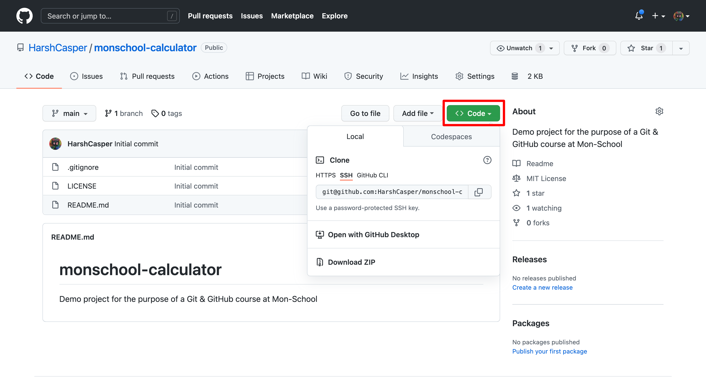
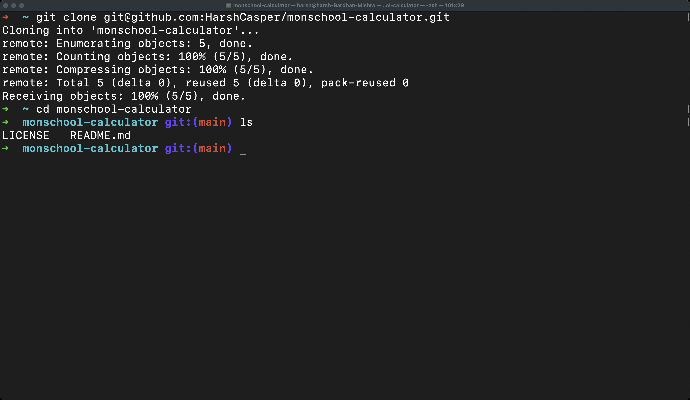

Cloning a repository in Git signifies making a copy of the repository on your computer. It simply means that you are downloading the repository's files and folders to your computer so that you can work on them. To clone a repository, you need to know the repository's URL. The repository can be hosted on some Git-hosting service provider, like GitHub, GitLab, Bitbucket, or a self-hosted Git server. By copying the URL and pasting it into your browser along with the `git clone` command, you can clone the repository:

```sh
git clone <repository-url>
```

After you enter this command on your command-line/terminal, the folder that would be created on your local machine will come built-in with a few things. First, Git will be already present in the folder as a `.git` folder. This folder is where Git keeps all of the information about the repository. It signifies that you don't need to initialize your Git repository manually all over again. Secondly, the connection between your local copy and the remote repository will be established. This means that you can start working on your repository right away and push your changes to the remote repository as and when desired.

Let's see how we can clone a repository from GitHub. First, we need to know the URL of the repository. The URL of a repository is the address of the repository on the web. The address of a repository is usually in the form of `github.com/<username>/<repository-name>`. For the purpose of this chapter, we will use the repository `monschool-calculator` which is hosted on GitHub: `https://github.com/HarshCasper/monschool-calculator`. You can clone your own repository by using the URL of the repository that was created in previous chapter.

Navigate to the repository's URL and you will see a green `Code` button on the right side of the repository. The button allows you clone this repository, open it using GitHub Desktop, download it as a ZIP, or open it on an online cloud editor. At first you will see a highlighted text stating `HTTPS`. Beside it you will notice a `SSH` button as well.

You can either choose HTTPS or SSH to clone the repository. HyperText Transfer Protocol Secure (HTTPS) and Secure Shell (SSH) are communication protocols that are used to securely transfer data between computers. HTTPS is the underlying protocol of the World Wide Web (WWW) and defines how messages are to be formatted and transmitted. SSH uses the built-in authentication system to establish a connection and uses cryptographic techniques to authenticate users.

For this chapter, we will use SSH. SSH, once configured, is faster and won't require you to authenticate with GitHub everytime you make a network connection. Click on `SSH` and copy out the text in the box. Now that we have the text copied, we can use it directly clone the repository.



Let us start our command-line/terminal on our local machine. Make sure that you are present on your home directory. You can now type the following command to clone the repository:

```sh
git clone <copied-url>
```

If the command is successful, you will see a new folder created on your local machine. The folder will have the name of the repository. Here is a snap of what it would look like after cloning the repository:

To navigate inside this folder, you can use the `cd` command and `ls` command to take a look at various files inside the lesson folder.

```sh
cd monschool-calculator
ls
```

You will see the following output:



Cloning a repository is essential and useful in a Git-based workflow because you can now work on the repository from your local machine without interfering with the remote repository. After sometime, when you are satisfied with your changes, you can push your changes to the remote repository and share it with other collaborators. Henceforth, before starting any work on a Git repository, you should clone it and check it out before making any changes.
