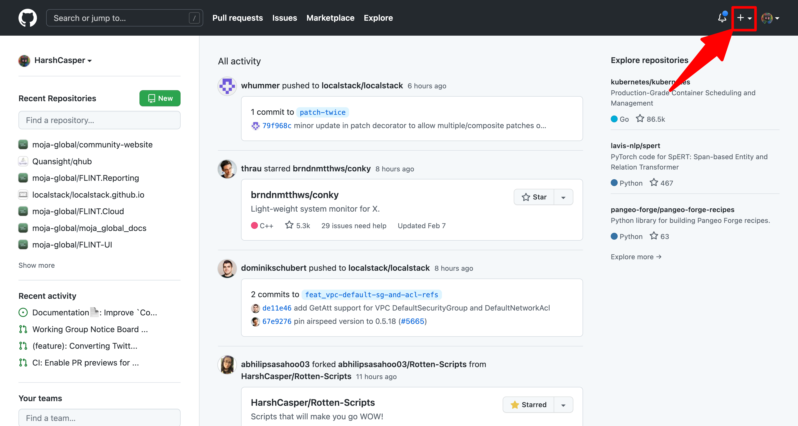
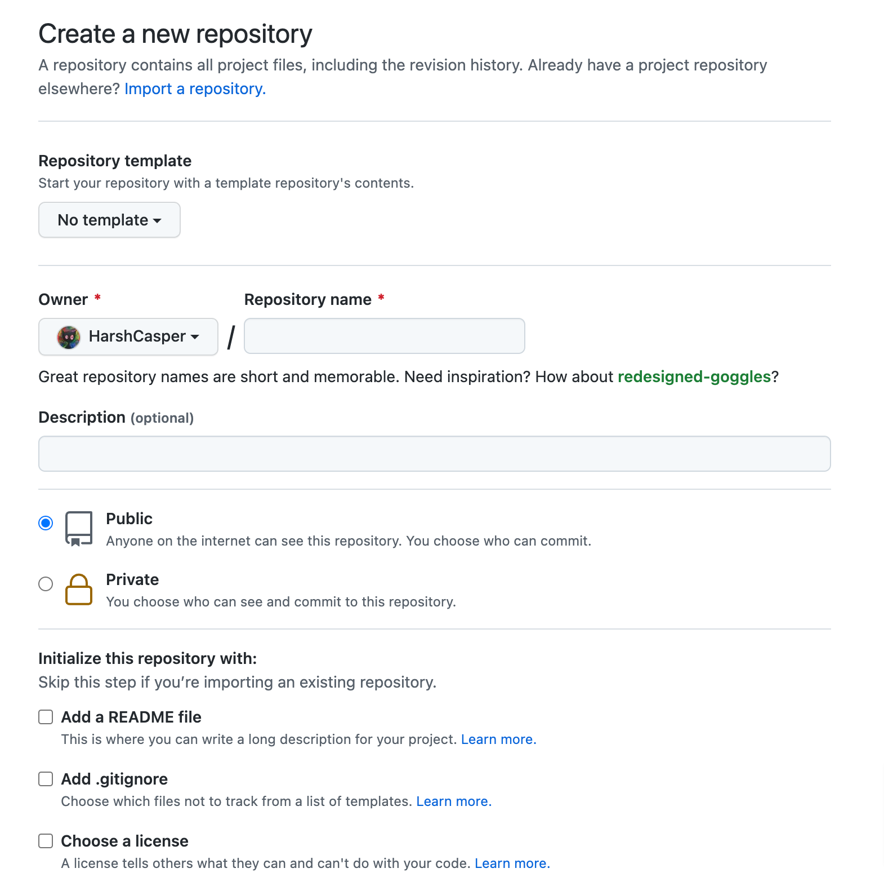
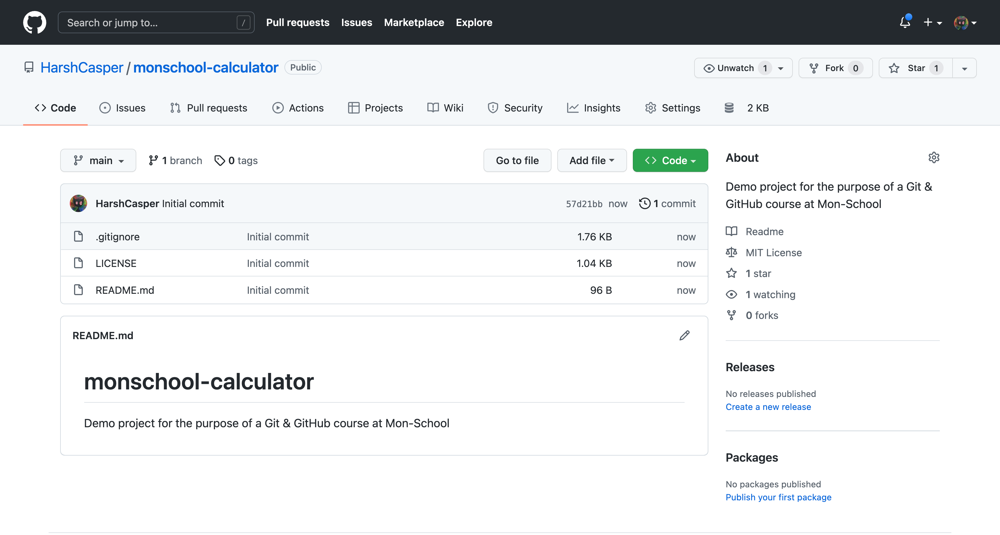
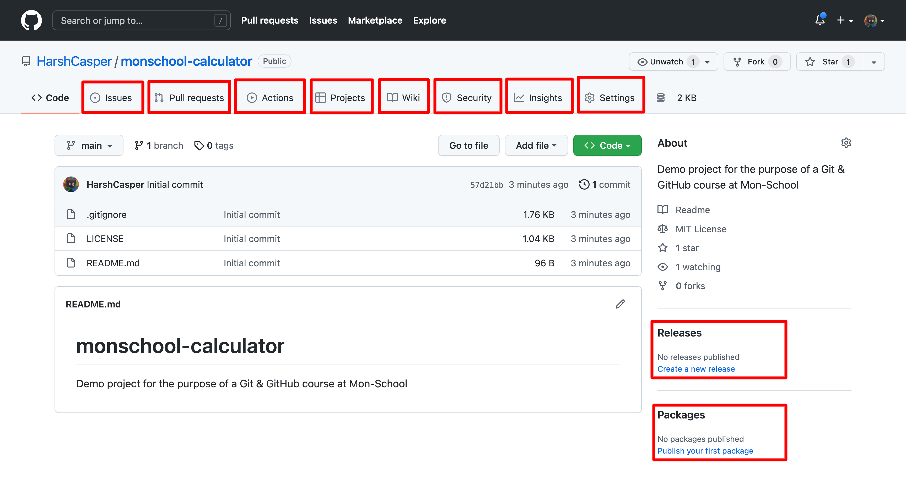

Git is traditionally used for version control. In simple terms, we want to track the state of the files and the changes that are being made to them over a period of time. To make sure we can do this, we need to store the state of the files in a specialized folder. In the Git context, this specialized folder is called as a **repository**.

A repository is a folder where the contents of the files are tracked by the Git and we can view all the changes that are being made to the files. Contrary to popular belive, a Git repository does not contain the files themselves. Instead, it contains the history of the files and the changes that are being made to them over the time. This history is stored in a `.git` directory in the root of the repository.

## Creating a Git Repository

You can create a Git repository on GitHub. As mentioned earlier, GitHub is a cloud-based Git-service provider, which is accessible through the Internet on any device. We can create a Git repository on GitHub and later clone it for our use. Through GitHub, you can make your project accessible to public or continue working on it privately.

Creating a Git repository on GitHub is simple. If you have not already made a GitHub account, you can do so by navigating to the [GitHub website](https://github.com) and making one!

After making a GitHub account, you can create a repository by navigating to your dashboard and clicking the `+` button at the top right corner:

You can further click the `New repository` button to create a new repository. You will be presented with the following screen:

You can fill in all the necessary details. Some of these are:

- **Repository Name**: The name of the repository. It should be unique within your profile and something that people can easily recognize.

- **Description**: A short description of the repository. It is entirely optional but helps people understand what the repository is about.

- **Public/Private**: Whether the repository is public or private. If you are looking to have a public repository, you can select the `Public` option. If you are looking to have a private repository with selected collaborators, you can select the `Private` option.

- **Initialize this repository with**: This option includes various customization options for the repository. You can opt in to have a `README.md` file, a `.gitignore` file, and a `LICENSE` for your repository.

Finally you can click on the `Create repository` button to create the repository.

Let us create a repository named `monschool-calculator` on GitHub. We will create a simple calculator which we will host on GitHub at the end of the repository. Follow the above steps and this will create a repository named `monschool-calculator` on GitHub:

## Aspects of a GitHub repository

A GitHub repository is available on GitHub. If its a public project, it can be accessed by anyone. If its a private project, it can be accessed only by the people who have been invited to collaborate.

In contrast, a Git repository is just available on your local machine. If you are collaborating with someone, you have to push your changes to the repository on GitHub or any other Git-service provider. Otherwise, its just you who is working on it.

But what do these different fields on a GitHub repository mean?

Let us explore them:

- **Issues**: This is where you can create issues for your repository. Issue can be bug reports, feature requests, or any other type of detail that you would like to work upon. You can create issues on other people's repositories as well to communicate with them.

- **Pull Requests**: This is where you can create pull requests, or in simple words contribute, to your project or anyone else's project. Pull requests are a way to share code with others and have them vet it before merging it into the project.

- **Actions**: Actions are event-driven automation inside GitHub, which allows you to trigger actions when certain events happen.

- **Projects**: Projects are a way to organize your repository and track important milestones. You can create a project and then add issues and pull requests to it.

- **Wiki**: This is where you can create and edit wiki pages. Wiki pages are a way to share information about your project with others.

- **Security**: This is where you can enable security features for your repository.

- **Insights**: Insights are a way to see what your project is doing. You can see how people are interacting with your project, what is the traffic and what is the network.

- **Settings**: This is where you can manage your repository. You can change the repository's name, description, and other settings.

- **Release**: This is where you can create and manage releases. Releases are a way to track and manage your project's versioning.

- **Packages**: Packages allow you to publish your code as a package over GitHub.

Every repository has a central `README.md` file which is the first file that is displayed when you visit the repository. This file is created automatically when you initialize a repository. A `README.md` file is a good place to introduce your project and provide instructions for users to set it up.

In the next chapters, we will learn how to clone our repository from GitHub, make our first commit and push the changes to GitHub.
