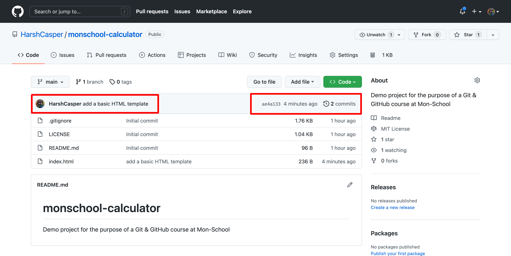

In the previous chapter, we made changes to our repository and committed them. Now, let's push those changes to the remote repository. It would allow your collaborators to view the changes that you have made and would allow them to pull your changes to their local repository. 

For the purpose of this course, we are using GitHub as our Git-based service provider, but you can use the same procedure to push your changes to any Git-hosting service provider (like GitLab or BitBucket).

In the `Git Repository` and `Git Cloning` chapters, we saw that we have created a repository on GitHub, cloned it and worked on it. To push your changes back to the remote repository, you can use the command `git push`. Let's try it out:

```sh
$ git push

Enumerating objects: 4, done.
Counting objects: 100% (4/4), done.
Delta compression using up to 10 threads
Compressing objects: 100% (3/3), done.
Writing objects: 100% (3/3), 427 bytes | 427.00 KiB/s, done.
Total 3 (delta 1), reused 0 (delta 0), pack-reused 0
remote: Resolving deltas: 100% (1/1), completed with 1 local object.
To github.com:HarshCasper/monschool-calculator.git
   57d21bb..ae4a133  main -> main
```

If you navigate to the GitHub repository, you will see that a new commit and a new file has been added to the repository.


