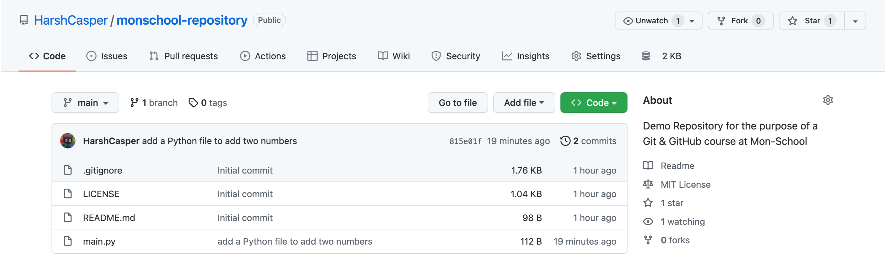

In the previous chapter, we made changes to our repository and committed them. Now, let's push those changes to the remote repository. It would allow your collaborators to view the changes that you have made and would allow them to pull your changes to their local repository. For the purpose of this course, we are using GitHub as our Git-based service provider, but you can use the same procedure to push your changes to any Git-hosting service provider (like GitLab or BitBucket).

In the `Git Repository` and `Git Cloning` chapters, we saw that we have created a repository on GitHub, cloned it and worked on it. To push your changes back to the remote repository, you can use the command `git push`. Let's try it out:

```sh
$ git push

Enumerating objects: 4, done.
Counting objects: 100% (4/4), done.
Delta compression using up to 10 threads
Compressing objects: 100% (3/3), done.
Writing objects: 100% (3/3), 387 bytes | 387.00 KiB/s, done.
Total 3 (delta 1), reused 0 (delta 0), pack-reused 0
remote: Resolving deltas: 100% (1/1), completed with 1 local object.
To github.com:HarshCasper/monschool-repository.git
   e6ee48a..815e01f  main -> main
```

If you navigate to the GitHub repository, you will see that a new commit and a new file has been added to the repository.



In case you are working on a parallel branch, you can push your changes to the remote repository using the command:

```sh
git push <remote_name> <branch_name>
```

The `remote_name` is the URL which has been pre-configured by Git. If you wish to take a look at the URL, you can use the command `git remote -v`. It will show the following output:

```sh
$ git remote -v
origin	git@github.com:HarshCasper/monschool-repository.git (fetch)
origin	git@github.com:HarshCasper/monschool-repository.git (push)
```

Here, `git@github.com:HarshCasper/monschool-repository.git` is a remote URL where we can push or pull our changes. You can add a new remote using the command `git remote add <remote_name> <remote_url>`. Let us try adding the same URL as a new remote named `remote-check`:

```
$ git remote add remote-check git@github.com:HarshCasper/monschool-repository.git
$ git remote -v

origin	git@github.com:HarshCasper/monschool-repository.git (fetch)
origin	git@github.com:HarshCasper/monschool-repository.git (push)
remote-check	git@github.com:HarshCasper/monschool-repository.git (fetch)
remote-check	git@github.com:HarshCasper/monschool-repository.git (push)
```

You can now push to the alternate remote URL named `remote-check` using the command:

```sh
git push remote-check main
```

The `branch_name` is the name of our branch, which in this case is `main`. If you are working on a seperate branch, you can push to it by changing the `branch_name` to your branch name.

If you wish to wish to push all your changes to the remote repository, including all the branches, you can use the command `git push --all <remote_name>`
