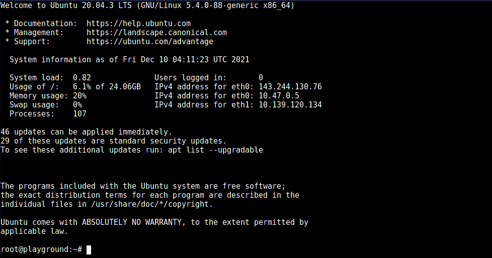

To get started with self hosting, you'll need a _server_ to run the applications. There are multiple options to get a server:

- Cloud based providers like AWS, DigitalOcean etc.
- Raspeberry Pi
- NAS like Synology

Some of these options require you to have purchase hardware. However if you don't want to make the upfront commitment of a hardware purchase as well as take over the responsibility maintaining it, cloud based providers are an excellent (de-facto) choice for majority of the people.

There are various options that you can explore while choosing a provider. It's possible to get the smallest instance (in terms of compute resources like RAM/CPU) for about $5 on DigitalOcean. AWS provides a free tier for 1 year as well. To keep things consistent across cohorts of students, we will be using DigitalOcean and all the further examples/course content will assume that you're running a DigitalOcean VPS (also called as _droplet_).

## Step 1: Create a new account at DigitalOcean

To create a droplet, you'll need a DigitalOcean account. Head over to [DigitalOcean](https://www.digitalocean.com/) and signup with your email/password. You'll need to enter your card details but you will only be billed at the end of billing cycle (monthly) for the resources you have created.

## Step 2: Create a new Project

[DigitalOcean Projects](https://docs.digitalocean.com/products/projects/) are a way to group together all resources under a single project. This helps you to quikcly find resources belonging to a project and make changes to them. For this course, let's create a Project titled "Monschool".

Visit [Projects](https://cloud.digitalocean.com/projects/new) and enter the following details:


Once you click on "Create Projects" you'll be prompted to move existing resources to this project. You can skip this section.

## Step 3: Create a new Droplet

Let's create a new droplet by visiting "Droplets" in the sidebar.


A form will open where you choose some basic configuration for the Droplet. For the purpose of this course, the following config should be enough:

- Image: Ubuntu 20.04 LTS (x64)
- CPU Plan: Basic (Shared CPU)
- CPU Options: Regular Intel with SSD ($5/mo plan)
- Datacenter Region: Pick the one closest to where you live. If you're from India you can choose _Bangalore_.
- Additional Options: `Monitoring`
- Authentication: Select `Password` for now. We will change to `SSH` based as we progress in the course.
- Hostname: `playground`. Feel free to get creative and name it whatever you like!
- Project: `Monschool`

Here's how it should look once you enter all the details:


Click on **Create Project** and wait for a minute or so. Your droplet is being created and after that you'll be able to login inside it.

## Step 4: Login to the droplet

### Using your local machine (preferred)

First, find the public IPv4 address of your droplet. It's mentioned on 

On your local dev machine, use `ssh root@<ip>`. You'll be prompted for a password and after that you'll be able to login to the server.

```bash
❯ ssh root@143.244.130.76
root@143.244.130.76's password: 
root@playground:~#
```

### Using DigitalOcean Console

Click on the droplet name once it's ready and you'll be taken to a page that has a bunch of different knobs to tweak your droplet. For now, we just want to access it, so visit `Access > Droplet Console`. Click on `Launch Droplet Console` and wait for a minute for the connection to establish.

A new browser window should open which would have a UI like that of a Terminal. 



---

Congrats! Give yourself a pat op the back. We've registered with a cloud provider, created a new droplet and are able to access it as well.

Next, we'll focus on learning some basics and best practices one should follow before deploying apps.
