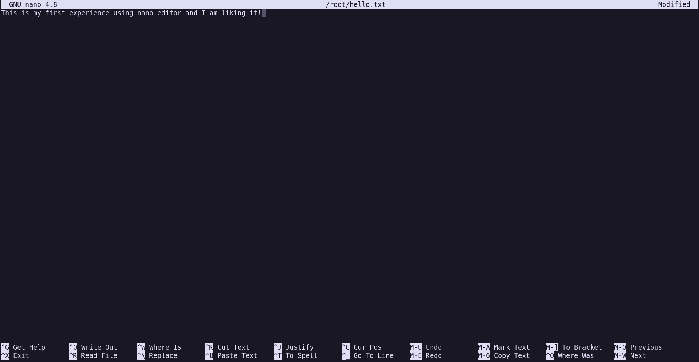

One of the most fundamental tasks that one should know inside servers is being able to edit files. You'll need to edit a config file, a cronjob, a service unit file and all of these tasks require that you understand how to edit files in a non GUI environment.

To keep things simple and straightforward, we'll use `nano`. If you know `vim`/`emacs` already you can ofcourse choose your own poison, but for beginners, `nano` is an excellent choice that mostly gets out of your way when editing files.

Let's create a dummy `hello.txt` inside the `~/`(`$HOME`) directory.

`nano ~/hello.txt`

An editor opens in which you can type file contents. Let's write a simple sentence:



In order to save the file, hit `Ctrl+X` and you'll be prompted for confirmation. Hit `Y` (_Yes_) to confirm that you want to save these changes.

It'll ask you to confirm the file path, simply press `Enter`.

Congrats! You've created and edited a file.

You can see the contents of the file you created using `cat`:

```bash
root@playground:~# cat ~/hello.txt 
This is my first experience using nano editor and I am liking it!
```

## Useful commands to know

Sometimes you need to create a directory to store files. You can do that with `mkdir`

`mkdir /path/to/directory`

If you want to _enter_ inside the directory, you need to run _change directory_ `cd`:

```
cd /path/to/directory
```

If you want to list all the files or directories, you can do that with `ls`:

```
ls /path/to/directory
```

To copy a file from one place to another, you can do that with `cp`

```
cp /source/a.txt /dest/a.txt
```

To remove a file:

```
rm /source/a.txt
```

To remove a directory and it's subdirectories:

```
rm -rf /path/to/directory
```

### Additional Resources

We've barely scratched the surface of the commands that will help you managing files/directories. The above commands also have some useful options, like `rm -i` which prompts for confirmation before deleting a file.

You are encourage to read `man` pages of these commands. [Manual pages](https://man7.org/linux/man-pages/) help to understand what each command does and what are the additional options (_flags_) you can pass to achieve your desired results.

To read man page of `ls`, for example, simply enter and a manual doc will open in your terminal:

```
man ls
```

There are some useful resources like https://tldr.sh/ and https://explainshell.com/ which can help you not feel overwhelmed with too much of docs suddenly and find out the flag/information about each command quickly.
