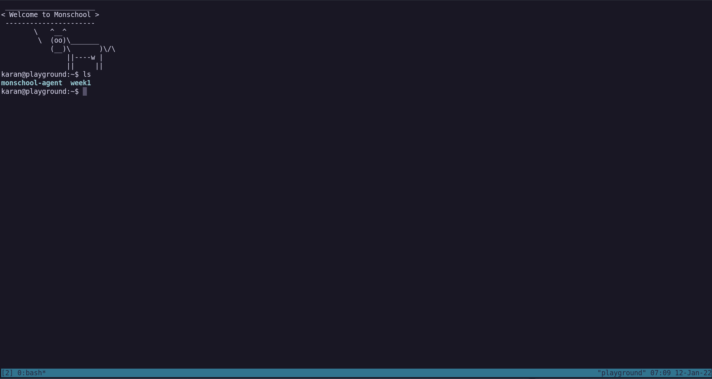

## Lesson Objectives

- [ ] Run a long-running command

### Refresher

We'll use some concepts here that was learned in the previous lesson. You can take a quick look at them to refresh them:

- `ssh user@ip` command to login from [Creating droplet lesson](./creating-droplet.md)
- `apt` commands from [Installing Packages lesson](./installing-packages.md)

---

`tmux` is a terminal multiplexer, which allows you to create and persist "shell sessions" on the server. This is helpful if you have to run a long-running command and don't want the process to be killed if your SSH connection is interuppted for any reason. This is also helpful if you have more than 1 person logging in to your server and you together need to work on the same session.

`tmux` allows you to _attach_ multiple shells to the same terminal session. That means you can open a `tmux` window, split it into multiple parts (_panes_) and run different commands on each of them.

Our task for this lesson is to run a command `fortune; sleep 60`. This command prints the message on the terminal but takes 60 seconds to complete.

Let's create a new session with:

```
tmux
```



You'll be logged into your current user account. `tmux` is controlled using what is called as **Modifier Key** (Mod). The default hotkey for that is `Ctrl+b`. This combination will be referred to as `mod` from now onwards.

### Running Commands

Let's run our command `fortune; sleep 60`. You'll notice the output gets printed immediately to the terminal but the prompt will be returned only after 60 seconds.

```
$ fortune; sleep 60
```

Since we don't want to wait for a minute, we can just _deattach_ from this session and return to our normal prompt. To do that, you'll need to use `mod d`. Once you press that, you'll be returned to the prompt from where you started the `tmux` session.

Here you can even list active sessions with:

```
$ tmux ls
0: 1 windows (created Tue Dec 14 18:19:10 2021)
```

To attach to the session we just created:

```
$ tmux a -t 0
```

Congrats! You completed the task for this lesson. We used `tmux` to run a long-running command and learnt how to attach/detach sessions.

## Additional Shortcuts

### Panes

- `mod %`: To split a window vertically.
- `mod "`: To split a window horizontally.
- `mod [`: To add a scrollbar to the current pane.

You can move around the panes with `mod + Right/Left/Up/Down` arrow keys.

### Windows

- `mod c`: Create a new window.
- `mod p`: Switch to previous window index.
- `mod n`: Switch to next window index.

You can explore some handy cheatsheets like https://tmuxcheatsheet.com/ and https://devhints.io/tmux for more commands.
