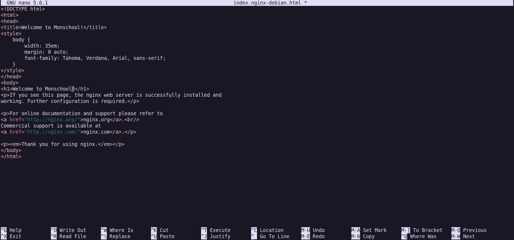
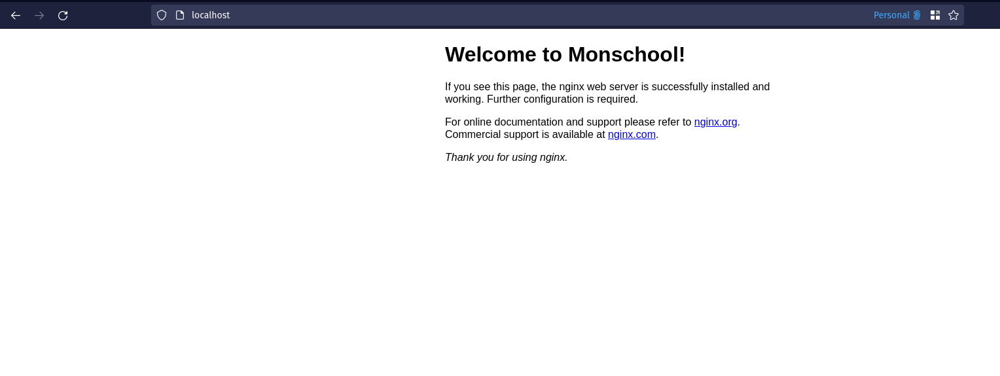

Now that we have `nginx` running on our server, let's learn how to modify the default Welcome page. But before that, we need to understand how `nginx` is configured.
The default place for `nginx` configuration is at the directory `/etc/nginx`.

Let's visit the directory and explore around:

```
$ cd /etc/nginx
$ ls
conf.d        fastcgi_params  koi-win     modules-available  nginx.conf    scgi_params      sites-enabled  uwsgi_params
fastcgi.conf  koi-utf         mime.types  modules-enabled    proxy_params  sites-available  snippets       win-utf
```

Here, we can see a bunch of different config files and folders that come with `nginx`. We're interested in finding out how to configure the welcome page, so we should first find out where it's configured. There are 2 places where configuration for `nginx` sites can be stored:

- Inside `conf.d` directory.
- Inside `sites-enabled` directory.

The `default` site is inside `sites-enabled`, so let's visit that.

```bash
$ cd sites-enabled
$ ls
default
```

We can see the config file `default` located here. Since we're interested in customising the _Welcome_ page, we first need to find out where that page is located.

Let's open this config file to see if it has any clues:

```
$ nano default
```

On scrolling through, we see a `server` block. A `server` block represents a website and `nginx` config can contain multiple such blocks to represent multiple websites . The usual config when loaded in `nginx` looks like:

```
http {
    server {
        ...
    }
    server {
        ...
    }
}
```

The _Welcome_ page is also located in this `server` block. On scrolling down a bit, we see something that is relevant for us:

```
        root /var/www/html;

        # Add index.php to the list if you are using PHP
        index index.html index.htm index.nginx-debian.html;
```

The [root](http://nginx.org/en/docs/http/ngx_http_core_module.html#root) directive is to specify where the assets are stored which is used to process the requests. We can see the directory `/var/www/html` mentioned in the config, which means our _Welcome_ page is present here. Let's visit that directory and find out!

```
$ cd /var/www/html
$ ls       
index.nginx-debian.html
```

We can see the `.html` file for the _Welcome_ page here. Let's edit the file and change the heading from _Welcome to NGINX_ to _Welcome to Monschool_:

```bash
sudo nano index.nginx-debian.html
```



Once the file is saved, we need to _reload_ nginx configuration for the changes to take place. We can use the following command to do that:

```
$ sudo nginx -t
nginx: the configuration file /etc/nginx/nginx.conf syntax is ok
nginx: configuration file /etc/nginx/nginx.conf test is successful

$ sudo nginx -s reload
```

`nginx -t` checks if your configuration is valid or not. It's a good practice to run this before reloading the configuration as any syntax errors in the configuration will cause `nginx` to not restart properly and cause a downtime of your website.

Alright, so once it reloaded, let's visit `localhost` on our browser and see our changes:



Perfect! In this lesson we learnt how `nginx` stores it's configuration and how to modify the default _Welcome_ page. In the next lesson, we'll be setting up our own HTML/CSS website designed for this course.
